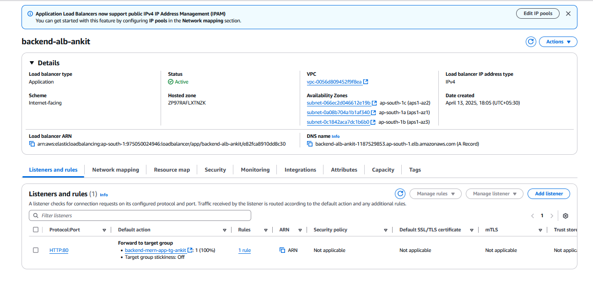
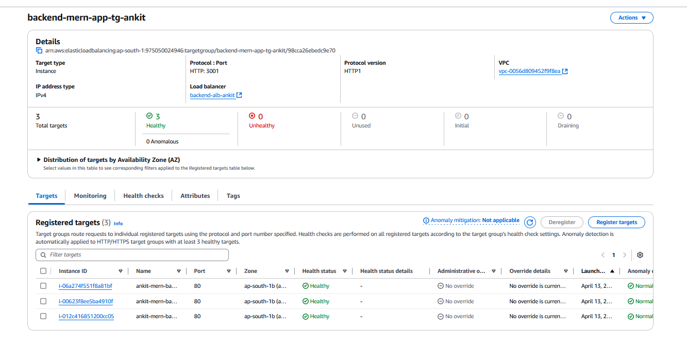
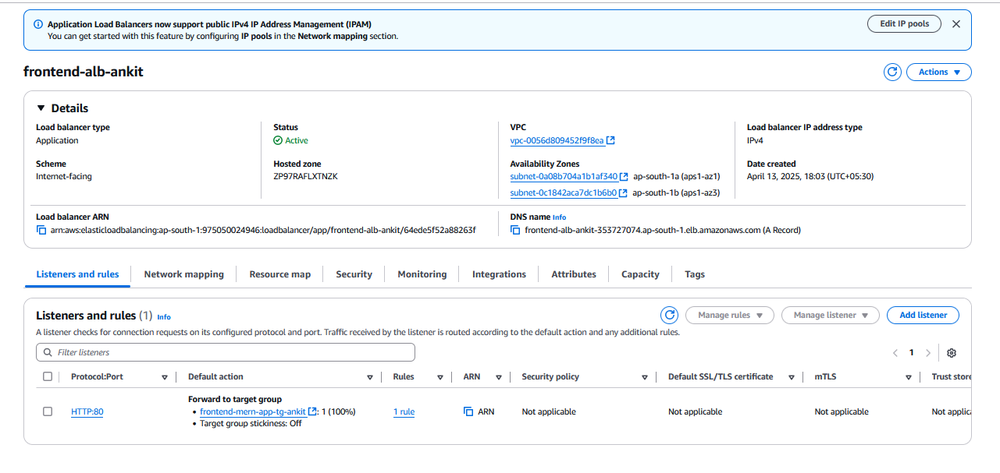
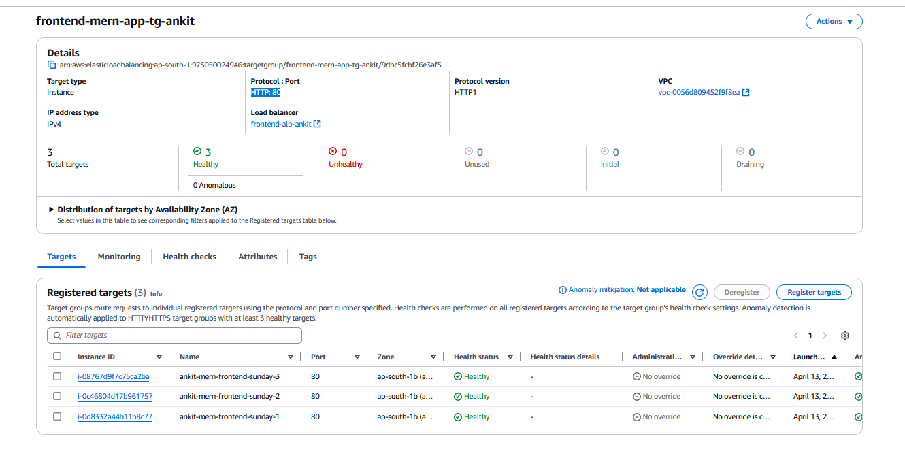
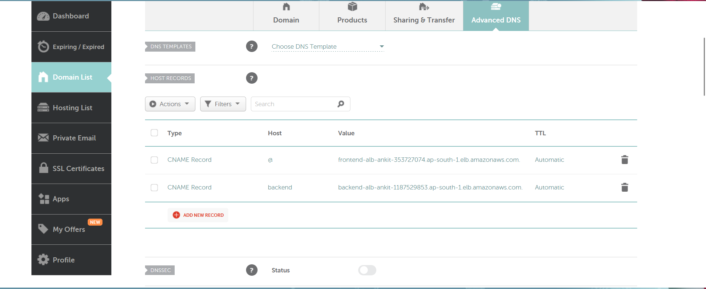
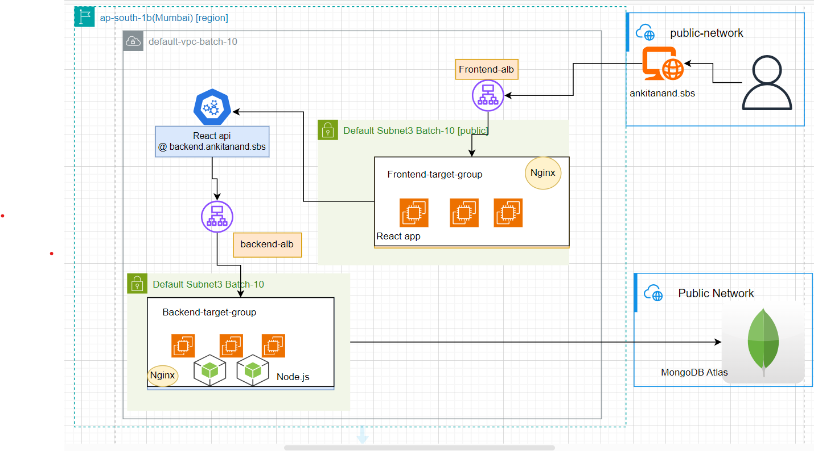

# 🌍 TravelMemory MERN Deployment

A full-stack travel memory logging application built using the **MERN stack** and deployed on **Amazon EC2**, complete with **load balancing** and **custom domain setup via Cloudflare**.

---

## 🚀 Project Overview

The **TravelMemory** application enables users to create and share travel memories with photos, descriptions, and locations. This project demonstrates end-to-end deployment and cloud scalability practices.

🔗 **GitHub Repository:**  
[https://github.com/UnpredictablePrashant/TravelMemory](https://github.com/UnpredictablePrashant/TravelMemory)

---

## 🎯 Objectives

- Deploy the Node.js backend on EC2.
- Configure the React frontend.
- Enable frontend-backend communication.
- Scale using multiple EC2 instances and load balancer.
- Connect a custom domain.

---

## ✅ Tasks & Setup Guide

### 1. ⚙️ Backend Configuration

#### 📅 Clone and Navigate
```bash
git clone https://github.com/UnpredictablePrashant/TravelMemory.git
cd TravelMemory/backend
```

#### 🔧 Install Dependencies
```bash
sudo apt update
sudo apt install nginx -y
sudot apt install git
sudo apt install nodejs -y
sudo apt install npm
npm install
```

#### 🛠️ Setup `.env` file
Create a `.env` file in the `backend/` folder:
```env
PORT=3001
MONGO_URI=your_mongodb_connection_string
```

#### 🂀 Run the backend
```bash
node index.js
```
#### 🌐 NGINX Reverse Proxy
Edit `/etc/nginx/sites-available/default`:
```nginx
server {
    listen 80;
    server_name backend.ankitanand.sbs
    
    location / {
        proxy_pass http://localhost:3001;
        proxy_http_version 1.1;
        proxy_set_header Upgrade $http_upgrade;
        proxy_set_header Connection 'upgrade';
        proxy_set_header Host $host;
        proxy_cache_bypass $http_upgrade;
    }
}
```


Restart NGINX:
```bash
sudo systemctl restart nginx
```

#### Create AMI of the instance

Create another 2 instances from the successfully created backend AMI to scale and attached to application load balancer.


#### Attaching custom domain to the backend ALB DNS

Once all the 3 backend servers are deployed and attached to the ALB via target group, attach the custom domain `backend.ankitanand.sbs` to the backend DNS.

#### ALB backend



#### Target Group



Note: The target group might show unhealthy however the ALB will run. To make them healthy in target group do add the path /trip in the health check tab.

#### Important

⚠️ Don’t use http:// or https:// in the value — just the plain DNS name.

-------

#### Result:


### 2. 🖼️ Frontend Configuration & Backend Connection

#### 📅 Clone and Navigate
```bash
git clone https://github.com/UnpredictablePrashant/TravelMemory.git
cd TravelMemory/backend

#### 🔧 Install Dependencies
```bash
sudo apt update
sudo apt install nginx -y
sudot apt install git
sudo apt install nodejs -y
sudo apt install npm
npm install
```

#### 🛠️ Setup `.env` file
```
REACT_APP_BACKEND_URL=http://backend.ankitanand.sbs
```

#### 🔗 Update `urls.js`
Edit `src/api/urls.js` to point to your backend:
```
export const baseUrl = process.env.REACT_APP_BACKEND_URL || "http://backend.ankitanand.sbs"
```

#### 🛠️ Build Frontend
```bash
npm run build
```

#### NGINX to serve the frontend:*
```nginx
server {
    listen 80;
    root /home/ubuntu/TravelMemory/frontend/build;
    index index.html;

    location / {
        try_files $uri /index.html;
    }
}
```


#### Attaching custom domain to the backend ALB DNS

Once all the frontend servers are deployed and attached to the ALB via target group, attach the custom domain `ankitanand.sbs` to the frontend DNS.

#### ALB backend



#### Target Group



### Result 

#### Frontend view


#### Add Experience tab 


### Custom domain Namecheap dashboard



## 📸 Final Deployment Checklist

- ✅ Backend running on EC2.
- ✅ Frontend served via NGINX
- ✅ Communication wired via `urls.js`.
- ✅ Load balancing configured with ALB.
- ✅ Domain connected through Namecheap DNS.

---


## MERN Application Architecture Diagram




